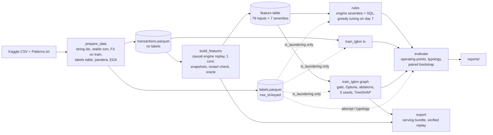

# Real-time anti-money-laundering detection with causal graph ML

Edge-level laundering detection on the IBM AML **HI-Small** transaction graph (5.08M transfers,
515K accounts), under a strict **as-of rule**: every score uses only transactions from strictly
earlier minutes. "Causal" in this README means exactly this temporal rule, not causal inference.
The project compares a label-tuned rule baseline (the bank's "incumbent"),
LightGBM on transaction features, LightGBM on causal graph features and, in a later milestone, a
causal GNN, all at the **same analyst alert volume**, and will then serve the champion from a
Kafka + FastAPI stream (M5, not built yet). Implementation plan: [PLAN.md](PLAN.md).

**Status: milestones M1 and M2 results are in** (M2 is the CV-ready checkpoint): the data
pipeline, the SQL rule baseline, LightGBM on per-transaction features, the evaluation harness,
and a causal streaming feature engine with LightGBM-graph and a verified serving bundle. Ruff and
the test suite pass locally; CI runs once the repository is pushed. Next, in order: M3 causal
Multi-GINe GNN on a Modal GPU, M5 streaming demo, M6 case packs and write-up. Every table below
comes from `reports/`, produced by the commands in [Reproduce](#reproduce). Stage run times, the
tuned class weight, the DuckDB-oracle check (`build_features --mode verify`) and the
serving-bundle verification come from the stage summaries on the Modal Volume
(`models/<stage>/<run_key>/summary.json`, `best_params.json`, `features/<run_key>/verify/`), and
the costs from Modal billing.

---

## Problem

Money laundering is hard to see in a single transfer and shows most clearly as a pattern across
accounts (fan-in, fan-out, cycles, scatter-gather). The task: flag laundering **transactions**
(graph edges) as they arrive, at an alert volume a team of analysts can review. One alert = one
flagged transaction; each operating point also reports alerted accounts per simulated day.

## Data

IBM Transactions for Anti Money Laundering, HI-Small (Altman et al., NeurIPS D&B; Kaggle,
CDLA-Sharing-1.0). Re-derived by code in [reports/eda.md](reports/eda.md):

| Fact | Value |
| --- | --- |
| Transactions / accounts / laundering | 5,078,345 / 515,088 / 5,177 (0.102%) |
| Span | 10 normal days + 8 sparse "tail" days (1,108 rows, 655 laundering) |
| Pattern file | 370 attempts in 8 typologies, 3,209 transactions (62% of positives); the other positives are called "integration" here (labelled, but absent from the pattern file) |
| Payment format | ACH carries 86.6% of positives; Wire, Reinvestment and cross-currency carry none |
| Hubs | max out-degree 168,672; train-period total degree q0.999 = 115 |
| Repeat accounts | 25.4% of test positives touch an account that laundered in train |
| CSV traps | unsorted rows, a repeated `Account` header, zero-padded bank codes (58 collide if parsed as integers), 19,779 hex ids that parse as floats |

**Split** (IBM Multi-GNN's day boundaries): train = days 1–6 (3.25M, 0.078%), `val_early` = day 7
(early stopping, HPO, rule tuning, feature gate, ablations), `val_late` = day 8 (thresholds),
test = days 9–18. Test is reported as the **primary period, days 9–10 (the headline, 0.111%)**,
the tail (days 11–18, 59% laundering) and the full period. Final models are trained on days 1–6
only, and the test set is touched once per final model.

## Evaluation protocol

- **As-of rule.** A transaction in minute *m* sees only events in minutes [*m* − W, *m* − 1];
  same-minute peers are invisible in both directions. Rules and features obey it. FX rates,
  category vocabularies and the hub list are fitted once on train (days 1–6) and applied unchanged
  to later days, so no validation or test row influences them. Labels live in a separate table.
  Randomised perturbation tests check every rule and every engine feature: changing, adding or
  deleting other events at minute ≥ *m*, same-minute peers included (also those ranked before the
  target), leaves the minute-*m* target's row and every earlier row unchanged. Test labels cannot
  move any choice: flipping every test label changes no rule threshold or flag, no LightGBM-tx
  score and no evaluation threshold; the feature table is bit-identical with every label flipped
  or with no labels file; and LightGBM-graph's tuning, ablations and scores are identical when the
  val_late and test labels are deleted.
- **Operating points** (primary period): (a) a *deployable* threshold chosen on `val_late` so the
  model's alert rate equals the rules' `val_late` rate, applied unchanged to test; (b) iso-volume
  top-K with K = the rules' alert count; (c) rules ∪ model, reported next to the model alone at the
  same (larger) volume. Alert budget = 0.5% of transactions, with 0.1% and 1% sensitivity rows.
- **Uncertainty.** A paired, stratified cluster bootstrap (B = 2,000): pattern positives are
  resampled by attempt, other rows by sender account; every model sees the same replicates.
  Multi-seed models (5 seeds) are averaged per replicate, each seed with its own threshold.

## Results

### Headline: primary period (days 9–10), 0.5% alert budget

| Model | Alerts | Precision % | Recall % [95% CI] | F1 % | PR-AUC % |
| --- | ---: | ---: | --- | ---: | ---: |
| Rules (SQL, label-tuned; 2 of 7 scenarios selected) | 4,110 | 1.6 | 6.9 [5.1, 9.1] | 2.6 | n/a |
| LightGBM, transaction features (M1), (a) | 4,268 | 7.6 ± 0.2 | 33.7 ± 1.0 [28.7, 38.4] | 12.3 ± 0.3 | 7.4 ± 0.2 |
| **LightGBM, causal graph features (M2), (a)** | 4,374 | **15.0 ± 0.1** | **68.4 ± 0.6** [60.0, 75.7] | **24.5 ± 0.2** | **57.4 ± 0.2** |
| LightGBM-graph, (b) top-K at the rules' volume | 4,110 | 15.8 ± 0.1 | 68.0 ± 0.5 [59.6, 75.1] | 25.7 ± 0.2 | |
| Rules ∪ LightGBM-graph (a) | 8,218 | 8.0 ± 0.0 | 68.6 ± 0.5 [60.2, 75.9] | 14.3 ± 0.1 | |
| LightGBM-graph alone at that union volume | 8,218 | 8.8 ± 0.1 | 75.4 ± 0.3 [66.3, 83.2] | 15.7 ± 0.1 | |

(a) = the deployable threshold. ± = std over 5 seeds; brackets = paired bootstrap CI.
**Paired differences** (percentage points, same replicates):

| Comparison | Recall (a) | Recall (b) | PR-AUC |
| --- | --- | --- | --- |
| LightGBM-graph − rules | **+61.5 [53.4, 68.7]** | +61.1 [53.0, 68.1] | n/a |
| LightGBM-graph − LightGBM-tx | **+34.7 [29.7, 39.9]** | +34.6 [29.6, 39.8] | **+50.0 [43.5, 55.8]** |
| LightGBM-tx − rules | +26.8 [22.0, 31.6] | +26.4 [21.6, 31.3] | n/a |

Adding the rules to either model is worse than spending the same extra alerts on the model alone:
−6.8 pp [−8.6, −5.3] for LightGBM-graph, −9.8 pp [−12.0, −7.6] for LightGBM-tx.

**Sensitivity to the alert budget** (primary period, recall %, at (a)):

| Alert rate | Rules | LightGBM-tx | LightGBM-graph |
| --- | ---: | ---: | ---: |
| 0.1% | 5.1 | 12.7 ± 0.2 | 52.0 ± 0.3 |
| 0.5% (headline) | 6.9 | 33.7 ± 1.0 | 68.4 ± 0.6 |
| 1% | 9.3 | 47.1 ± 0.6 | 76.1 ± 0.3 |

**Recall per typology at (a)**, primary period:

| Typology | Positives | Rules % | LightGBM-tx % | LightGBM-graph % |
| --- | ---: | ---: | ---: | ---: |
| FAN-OUT | 65 | 4.6 | 59.7 ± 2.0 | 100.0 ± 0.0 |
| FAN-IN | 57 | 5.3 | 54.7 ± 1.5 | 97.2 ± 1.0 |
| CYCLE | 55 | 29.1 | 46.5 ± 4.4 | 94.5 ± 0.0 |
| SCATTER-GATHER | 110 | 8.2 | 53.6 ± 1.8 | 98.9 ± 0.4 |
| GATHER-SCATTER | 127 | 4.7 | 49.4 ± 3.2 | 97.8 ± 0.4 |
| STACK | 84 | 7.1 | 61.2 ± 3.1 | 95.2 ± 1.2 |
| BIPARTITE | 44 | 13.6 | 49.1 ± 2.0 | 93.2 ± 0.0 |
| RANDOM | 43 | 32.6 | 47.9 ± 7.5 | 94.9 ± 1.0 |
| OTHER (non-pattern, "integration") | 371 | 0.8 | 3.0 ± 0.4 | 23.4 ± 1.0 |

At the attempt level, LightGBM-graph alerts on at least one transaction of **98.9%** of the 174
laundering attempts active in days 9–10 (LightGBM-tx 73.6% ± 1.7, rules 31.6%), with a median
time to first alert of 0 minutes (the attempt's first transaction in the period).

**Memorisation check.** LightGBM-graph uses account-level history, so it could in principle learn
"this account laundered before". It does not look like it: recall is *higher* on positives that
touch no train-period launderer (73.0% ± 0.7, 660 positives) than on those that do (58.2% ± 0.7,
296 positives). There are no id features. Full tables, the tail and full views, per-scenario
rule counts and time to first alert: [reports/results.md](reports/results.md).

### What the results show

- **Causal graph features double the recall at the same alert volume** (33.7% → 68.4%), and
  multiply PR-AUC by about 8 (7.4% → 57.4%). Against the label-tuned rules it is about 10× the
  recall, and the gap holds at 0.1% and 1% budgets.
- **Every pattern typology is caught at 93–100% transaction recall**, and 98.9% of attempts get
  an alert, including CYCLE and RANDOM, where the M1 rules alerted on more attempts than the M1
  model (59.1% vs 46.4% and 76.5% vs 49.4%; LightGBM-graph 100% and 94.1%), although per
  transaction the M1 model was already ahead.
  Non-pattern ("integration") laundering, 39% of positives in days 9–10, rises from 3% to 23%
  recall and remains the hard part.
- **What carries the signal** (validation ablations, below): the PORT group (new counterparties,
  Multi-GNN-style ports, time since last activity) is the most valuable group (−6.8 pp AP when
  removed), then payment format (−4.1 pp). The explicit cycle and scatter-gather counts add almost
  nothing: 3- and 4-hop cycles are too rare in train to learn from (30 and 8 non-zero train rows),
  and the remaining cycle and scatter-gather signal probably overlaps with the newness and
  velocity features (not measured directly).
- **The tuned incumbent is weak on this data** (M1): seven classic scenarios, thresholds
  grid-searched on day 7, find 6.9% of laundering. The tuner selects only rapid pass-through and the
  2–3-hop round trip; no other scenario adds enough day-7 true positives within the remaining
  budget (structuring joins at 1%).

### Validation evidence for M2 (no test label used)

**Feature gate** (label-free, before any fit): a feature is dropped if PSI(warm train days 4–6 vs
day 7) > 0.25, if more than 1% of its day-7 values fall outside the warm-train range, or if fewer
than 100 train rows are non-zero. It kept **75 of 79** inputs and dropped `v_in_cnt_3d` (PSI 0.35),
`pair_cnt_3d` (PSI 0.73), `cyc3_2d` (30 non-zero train rows) and `cyc4_2d` (8). The rule is fixed
in `configs/lgbm.yaml`, and the job stops for a decision if more than 25% of engine features would
drop.

**Group ablation** (val_early average precision, seeds 0–2, tuned parameters fixed). The decision
rule was fixed before the first real run: drop the one group with the largest gain only if the
gain exceeds 2σ of the pooled seed noise (σ = 0.19 pp).

| Variant | Inputs | val_early AP % | Δ vs full, pp |
| --- | ---: | ---: | ---: |
| full (champion) | 75 | 60.96 ± 0.07 | 0 |
| −VEL (velocity, fan) | 60 | 59.96 ± 0.14 | −1.00 |
| −AMT (amount statistics) | 55 | 61.09 ± 0.08 | +0.12 |
| −FLOW (pair, pass-through, balance) | 70 | 60.73 ± 0.08 | −0.23 |
| −PORT (new counterparty, ports, gaps) | 66 | 54.12 ± 0.33 | **−6.84** |
| −CYC (cycles) | 74 | 60.87 ± 0.26 | −0.10 |
| −SG (scatter-gather) | 71 | 61.21 ± 0.22 | +0.24 |
| −RULE (rule-support counts) | 63 | 60.42 ± 0.22 | −0.54 |
| no gate (all 79) | 79 | 61.13 ± 0.08 | +0.16 |
| no payment format (shortcut check) | 66 | 56.91 ± 0.24 | **−4.06** |

No group clears the bar (largest gain: −SG, +0.24 pp < 0.39 pp), so the champion uses all 75
gated inputs. The payment-format ablation is reported on validation only; the shortcut is worth
about 4 pp of AP, and the graph features carry most of the signal without it.

**TreeSHAP** (seed-0 champion, day 7: all 497 positives + 100,000 sampled negatives; mean |log-odds
contribution| on positives, summed per group): TX 4.46, PORT 3.05, AMT 0.93, VEL 0.75, RULE 0.67,
FLOW 0.48, CYC 0.11, SG 0.01. Ranked over the whole sample, the top features are
`payment_format`, `u_out_uniq_3d` (fan-out), `pair_is_new`, `pair_cnt_1d` and `log_amount_usd`; on
positives alone, `payment_format` (3.17), `pair_is_new` (0.95), `log_amount_usd` (0.78) and
`in_port` (0.57) lead.

### Literature-comparable metrics and the reference table

Published HI-Small numbers are minority-class F1 on the whole post-validation period (our *full*
view, days 9–18) at the argmax threshold (0.5). Under that protocol:

| Model (this project, causal) | Full view: F1 @ 0.5 | Full view: F1 @ `val_late`-best-F1 threshold | Full view PR-AUC | Primary: F1 @ 0.5 |
| --- | ---: | ---: | ---: | ---: |
| LightGBM-tx | 0.9 ± 1.2 | 22.6 ± 0.4 | 15.0 ± 0.1 | 0.7 ± 1.0 |
| LightGBM-graph | **68.1 ± 0.3** | 74.0 ± 0.3 | 74.2 ± 0.1 | 53.2 ± 0.3 |

- LightGBM-tx's argmax F1 is degenerate: almost every probability stays below 0.5, because the
  tuned positive-class weight (6.8) is far below the ~1:1,280 train class ratio.
- LightGBM-graph's full-view argmax F1 (68.1) is numerically close to the published
  Multi-PNA+EU figure (68.2), with strictly causal features. It is not a like-for-like comparison
  (the protocols differ, see below), and later published GNNs report about 74–76. Read it with
  care: the full view is dominated by the tail (41% of test positives in 0.13% of rows), where the
  same argmax F1 is 85.2 (recall 75.4%, precision 97.9%); on the primary period it is 53.2. M3
  measures a causal GNN under the same protocol.

These are **reference numbers from the papers, not results of this project**, and they are not
directly comparable: they use argmax; the GNN rows use non-causal neighbour sampling (the
published test graph holds all edges; Multi-GNN also drops unsampled target edges from its F1);
and the GFP rows probably use a different split. The table is a selection: later GNNs report about 74–76, and a
feature + boosting method about 79–81 on its own split (PLAN.md §12).

| Method (published) | HI-Small minority-class F1 % |
| --- | ---: |
| GIN | 28.7 |
| PNA | 56.8 |
| Multi-GIN+EU | 64.8 |
| Multi-PNA+EU | 68.2 |
| LightGBM + GFP | 62.9 |
| XGBoost + GFP | 63.2 |
| LightGBM, raw transaction features | 21.3 |

Sources: Altman et al. (arXiv 2306.16424), Egressy et al. (arXiv 2306.11586), Blanuša et al.
(arXiv 2402.08593); the anchors are recorded in PLAN.md §12 and, for the raw-feature LightGBM,
§6 M1.

## The causal feature engine (M2)

One incremental engine ([src/aml/features/engine.py](src/aml/features/engine.py), pure Python)
computes every model input and the seven rule severities. The same code produces the offline
training table (a 1-core replay of all 5.08M events), will score the Kafka stream in M5, and backs
the rule predicates.

- **As-of by construction.** Events of minute *m* are scored against the state as of *m* − 1 and
  applied only when the minute advances (a one-minute commit buffer). Windows expire to
  [*m* − W, *m* − 1] with one cursor per window over a shared ring of events.
- **79 inputs in 8 groups**: the 9 transaction features of M1; velocity and fan-in/out (1 and 3
  days); amount statistics (sums, means, std, max, deviation); pair and flow (pair repeats, the
  sender's 12-hour inflow and pass-through ratio, in/out balance); ports and gaps (new
  counterparty, Multi-GNN-style ports, minutes since last activity); temporal cycles of length
  2–4 closing on the new edge; scatter-gather / gather-scatter; and rule-support counts (in-band,
  round amounts, new counterparties, per payment format). Window lengths are config values chosen
  by AML meaning (a daily monitoring window and a 3-day layering window) and the M1 rule windows,
  not tuned on data.
- **Speed and memory, measured on the real data** ([reports/engine_bench.md](reports/engine_bench.md)):
  the full replay takes **7.6 minutes on 1 core** (engine 57 µs/event plus 9.5 µs/event of I/O;
  minute flush p99 14.5 ms). The engine state measures at most **362 MB** (tracemalloc of a
  restored engine; projected live peak 433 MB, target < 1 GB); the whole replay process, Parquet
  I/O included, peaks at 2.2 GB RSS. Graph searches walk in-edges only, so a hub's 168,672
  out-edges are never expanded.
- **Rule parity:** the engine's seven severities equal the M1 DuckDB SQL **on all 5,078,345 rows
  (0 mismatches, 0 truncated rows)**, and re-tuning on them reproduces M1's thresholds and flags
  exactly ([reports/parity.md](reports/parity.md)).
- **Independent oracle:** a separate DuckDB implementation of 75 of the 79 features agrees with the
  engine on every real row (0 mismatches); a brute-force Python reference and a Hypothesis state
  machine cover the rest on synthetic data.
- **Exact restart:** state snapshots (no pickle) are written at the start of days 7 and 9.
  Restoring the day-7 snapshot and replaying days 7–8 gives bit-identical rows, identical file
  hashes and an identical state digest.
- **Serving bundle** (`make export`): the seed-0 LightGBM-graph booster, feature spec, train-fitted
  preprocessing, thresholds, isotonic calibration (display only), the test-boundary snapshot, a
  100,000-event replay slice and its offline reference features, scores and alerts. Before the
  bundle's metadata is written, the slice is replayed from the snapshot: **features and scores
  are bit-identical to the offline ones on all 100,000 events.** This is what M5's streaming
  parity test builds on.

## The rule baseline

Seven scenarios in DuckDB SQL ([src/aml/rules/scenarios.sql](src/aml/rules/scenarios.sql)), each a
numeric severity under the as-of rule: fan-in velocity, fan-out velocity, rapid pass-through,
2–3-hop round trip, structuring below 10,000 USD, round-amount bursts, and Cash/Bitcoin bursts.
There is no cross-currency rule: cross-currency transactions carry no laundering in the data (the
EDA counts all days, but with no day-7 positives the tuner could never switch such a rule on).
Thresholds are grid-searched on `val_early`: for each budget the tuner keeps the best of a ratio
greedy, a gain greedy and the best single scenario, by day-7 true positives under the union alert
budget. From M2 on, the same severities come from the feature engine and are checked against the
SQL on every row.

Two design decisions, both driven by the data:

- **Hubs.** Accounts whose train-period degree exceeds the q0.999 cap (115) are excluded as
  round-trip intermediates, which bounds the multi-hop join. They are also segmented out of fan-out
  velocity and Cash/Bitcoin bursts (`exclude_hub_senders` in [configs/rules.yaml](configs/rules.yaml)).
  Without that, a few hubs that pay thousands of counterparties a day make even "≥ 1,000 receivers
  in 24 h" exceed the whole alert budget, so the scenario could never be switched on. Hub senders
  get severity 0 in these two scenarios: an exemption, where a production system would give the
  segment its own thresholds. It makes both scenarios feasible candidates for tuning; in the event
  the tuner selects neither at any budget, so the final incumbent is unchanged.
- **Tuned on labels.** Thresholds are chosen with perfect, complete day-7 labels, which is more
  than a real incumbent gets (it sees only investigated alerts and SAR outcomes). The rules are a
  generous baseline, not a straw man.

## Architecture (M1 + M2)



Every stage is one Modal job (`uv run modal run -m modal_jobs.<stage>`), on CPU containers; the
Modal Volume `aml-data` holds the data, feature tables, models and MLflow runs (a file store with
one directory per run). The laptop only edits code, runs the tests on a tiny synthetic fixture,
and drives the Modal CLI. The GPU (an L4) has so far been used only by the feasibility spike and
the smoke test; GNN training in M3 will use it.

## Reproduce

Requirements: [uv](https://docs.astral.sh/uv/), a Modal account (`uv run modal setup`), and the
setup in [docs/modal/getting-started.md](docs/modal/getting-started.md) (an `aml-data` Volume; the
Kaggle files download anonymously, the `kaggle` Secret is only a fallback).

| Stage | `make` | Raw command (also on Windows) |
| --- | --- | --- |
| Setup | `make sync` | `uv sync` (no torch on the laptop) |
| GPU smoke test | `make smoke` | `uv run modal run -m modal_jobs.smoke [--gpu T4]` |
| Data + EDA | `make data` | `uv run modal run -m modal_jobs.prepare_data` |
| Rules, M1 SQL stage | (none) | `uv run modal run -m modal_jobs.rules --source sql` |
| LightGBM (transaction features) | `make lgbm` | `uv run modal run --detach -m modal_jobs.train_lgbm` |
| Feature engine bench (M2) | `make features-bench` | `uv run modal run --detach -m modal_jobs.build_features --mode bench` |
| Feature replay (M2) | `make features` | `uv run modal run --detach -m modal_jobs.build_features --mode full` |
| Feature oracle check (M2) | `make features-verify` | `uv run modal run --detach -m modal_jobs.build_features --mode verify` |
| Rules on engine severities (M2) | `make rules` | `uv run modal run -m modal_jobs.rules` (needs `make features`) |
| LightGBM-graph (M2) | `make lgbm-graph` | `uv run modal run --detach -m modal_jobs.train_lgbm --feature-set graph` |
| Evaluate | `make eval` | `uv run modal run -m modal_jobs.evaluate` |
| Serving bundle (M2) | `make export` | `uv run modal run -m modal_jobs.export` |
| Pull reports | `make pull-reports` | `uv run modal volume get --force aml-data /reports .` |
| Pull the serving bundle | `make pull` | `uv run modal volume get --force aml-data /models/serving .` |
| MLflow UI | `make mlflow-ui` | `uv run modal serve -m modal_jobs.mlflow_ui` |
| Tests | `make test` | `uv run pytest` |

With the current (M2) code the pipeline is
`make data features-bench features features-verify rules lgbm lgbm-graph eval export`. `make rules`
runs the rules on engine severities, which needs `make features`; the unchanged M1 SQL rules stage
is the `--source sql` command above, and when its outputs exist for the same prepared data, the
engine stage checks that it reproduces their thresholds and flags. Stage outputs are keyed by a
hash of the configs they depend on and stamped with a fingerprint of the prepared data, so a stage
refuses to run on outputs built from other configs or other data. Code is not part of the key
(the feature engine opts in with its version number, and the stages that read the feature table
record its content digest): after changing a stage's code, re-run that stage and every stage after
it. `uv run modal run -m modal_jobs.evaluate --cost-only` refreshes `reports/cost.md` without
touching test again. On Windows, set `PYTHONIOENCODING=utf-8`, and in Git Bash
`MSYS_NO_PATHCONV=1` (otherwise `/reports` is rewritten into a Windows path).

**Cost.** All project compute so far metered about $1.3 of Modal credits: M1 about $0.25 (two full
pipeline runs, smoke tests and rule re-runs; a full M1 run costs about $0.09) and M2 about $1.1,
against caps of $3 each. In M2 the LightGBM-graph stage (gate, 15 Optuna trials, 30 ablation fits
and the finalists on 8 cores, 109 minutes) is about $0.93; the feature bench, replay and oracle
together cost about $0.08. Per-app costs: [reports/cost.md](reports/cost.md), which counts complete
billing hours before the report was written. The budget for all milestones is in PLAN.md §2.3.

**Reproducibility check (M1).** After deleting every model output on the Volume, running the four
M1 stages with the M1 code from a clean copy of the repository reproduced the M1
`reports/results.md` and `reports/eda.md` byte for byte (the LightGBM seeds are deterministic: identical validation PR-AUC to the last
digit). One limit: the FX rates come from a least-squares fit whose last bits can depend on the
CPU's BLAS kernels, so on a different machine `amount_usd` (and the features read from it) can
differ in the last few bits; the tests compare such features within 16 ulps and every other
feature bit for bit.

## Tests

`uv run pytest` runs 864 tests in about 3.5 minutes on a tiny synthetic dataset with the
real file format and its traps (`tests/fixtures/synthetic.py`), with no network and no Modal:

- **Leakage:** as-of perturbation tests for every rule and engine feature, including same-minute
  peers ranked before the target; within-minute permutation and disconnected-component (locality)
  invariance; label-flip invariance of features, rule thresholds and flags, and LightGBM-tx
  scores, and identical LightGBM-graph outputs with the val_late and test labels deleted; train-only
  FX and vocabularies; a feature whitelist (no ids, timestamps, labels, hub flags or severities as inputs).
- **Engine correctness:** an independent brute-force reference written only from the spec, a
  Hypothesis state machine with snapshot/restore mid-stream, a DuckDB feature oracle, a golden file
  of the first 2,000 events, determinism across hash seeds, and restart in a fresh subprocess.
- **Rule parity:** engine severities equal the SQL on fixture, dense-tie and Hypothesis frames for
  several windows, hub caps and segmentation settings; every SQL severity equals a brute-force
  Python reference.
- **Metrics:** sklearn parity, weighted = replicated rows, bootstrap reproducibility.
- **End to end:** prepare → rules → LightGBM → evaluate, and build_features → rules (engine) →
  LightGBM-graph → evaluate → export with bundle verification, on the fixture.
- **Environment:** the Modal image pins equal `uv.lock`; M1 run keys are pinned.

CI (`.github/workflows/ci.yml`) runs ruff and pytest on Linux.

## Repository layout

```
configs/          data.yaml · rules.yaml · lgbm.yaml (+ graph:) · features.yaml · serving.yaml
src/aml/data/     download, ingest (string ids, stable sort, FX), split, patterns (labels), schemas, EDA
src/aml/features/ engine (+ windows, ports, cycles, snapshot, spec), build (replay), gate, oracle,
                  tx_features
src/aml/rules/    scenarios.sql (DuckDB) + sql_baseline.py (tuning) + scenarios.py (engine parity)
src/aml/models/   lgbm.py, lgbm_graph.py (gate, ablations, finalists), importance.py (TreeSHAP)
src/aml/eval/     metrics, operating points, typology, paired bootstrap, report
src/aml/serving/  bundle.py (serving bundle + verification)
modal_jobs/       common.py (images, Volume, run keys) + one module per stage
tests/            unit/, leakage/, parity/, property/, golden/, fixtures/, end-to-end tests
reports/          eda.md, results.md, engine_bench.md, parity.md, cost.md (committed outputs)
```

## Caveats

- **The data is synthetic.** Labels are perfect and instantly available, there is no KYC or
  geography, and there are shortcuts such as payment format (ACH carries 86.6% of positives; its
  ablation costs LightGBM-graph about 4 pp of validation AP).
- "Causal" means features and sampling (strictly earlier minutes), not label availability.
- The tail (days 11–18) holds 41% of test positives in 0.13% of rows and is 59% laundering, and
  its windows are sparse, so tail and full-period numbers are inflated (LightGBM-graph reaches
  98.4% recall there). The primary period is the headline.
- Feature windows are chosen by AML meaning and the M1 rule windows, not tuned; the IBM Graph
  Feature Preprocessor's exact window settings were not verified and are not claimed.
- The hub list is fitted on train (days 1–6) and only restricts graph searches and rule
  segmentation; for train-day rows it is a mild in-sample look-ahead, the same kind as the
  train-fitted FX rates (PLAN.md §4). Hub status is never a model input.
- Port features are lifetime counts that grow with absolute time, and the new-pair and gap
  features depend on lifetime history (gaps are capped at 3 days, 0 = no history), so their
  distributions drift; the PSI gate checks the drift between train and validation (the largest
  kept, `pair_gap`, has PSI 0.249).
- The rules are tuned with perfect, complete day-7 labels, which a real incumbent does not have;
  the alert budget (0.5%) is an assumption, with a sensitivity table.

## At scale I would…

Use a feature store with a streaming push source (Feast), Kubernetes or managed cloud services,
Flink or Spark streaming, multi-partition Kafka with graph partitioning, an orchestrator
(Airflow), a Prometheus + Grafana server, and larger datasets (HI-Large). These are deliberately
out of scope for this project (PLAN.md §9).
