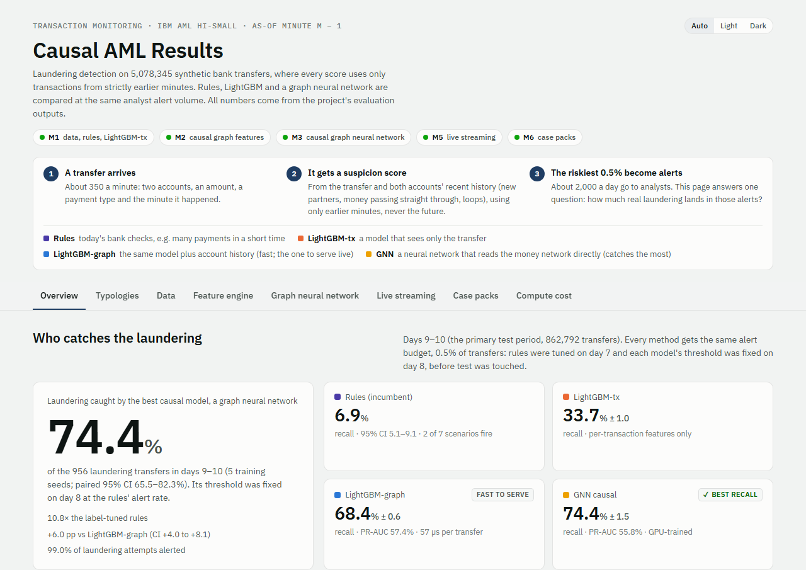
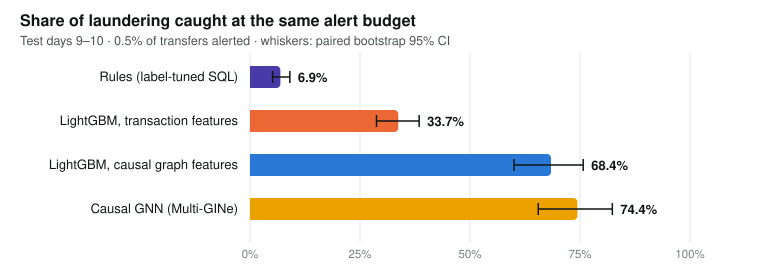
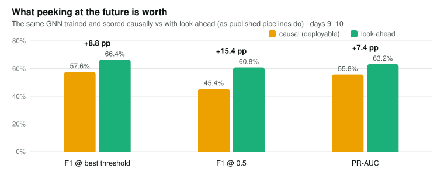
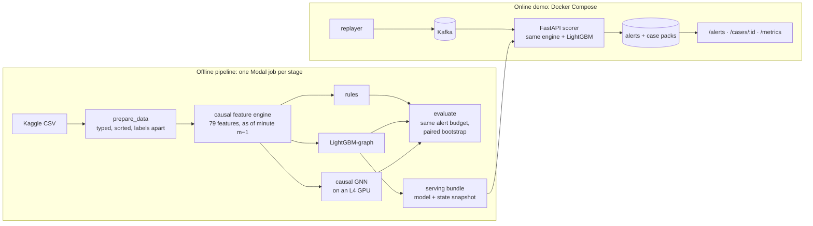
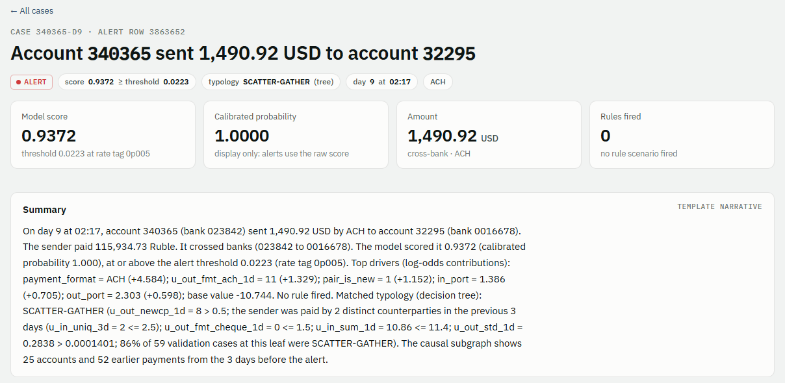
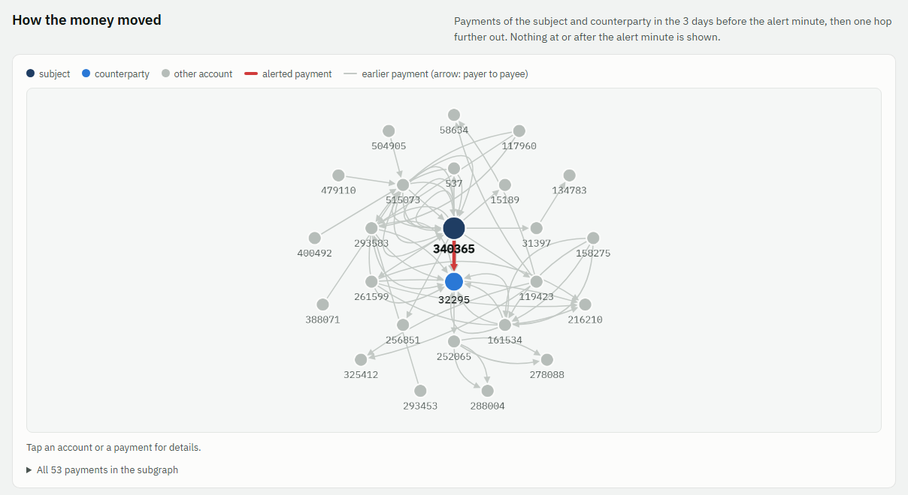

# Real-time money-laundering detection with causal graph ML

**Flags laundering transfers in a 5-million-transaction bank graph as they stream in, using only
the past, and catches 10× more laundering than rule-based monitoring at the same analyst
workload.**

<picture>
  <source media="(prefers-color-scheme: dark)" srcset="docs/img/dashboard-dark.png">
  
</picture>

<sub>The interactive results dashboard (<code>reports/dashboard.html</code>, one self-contained file: download
it and open it in any browser).</sub>

## Highlights

- **74% of laundering caught vs 7% for bank rules** under the same 0.5% alert budget, by the
  graph neural network (72% at exactly the rules' alert count). The model that runs live in the
  stream, LightGBM on graph features, catches **68%** (IBM AML HI-Small test days, paired
  bootstrap CIs, 5 seeds).
- **1,560 automated tests, all passing.** GitHub Actions runs them on every push, with a real
  Kafka broker: leakage checks, offline-vs-stream parity, Kafka integration and end-to-end runs on a
  small synthetic dataset.
- **No peeking at the future, proven by tests.** Every feature, rule and graph-neighbourhood
  sample uses only strictly earlier minutes. Perturbation tests check it, and a runtime guard found
  0 violations over 7.9 billion sampled graph edges.
- **Measured what look-ahead is worth.** The same GNN gains +7.4 PR-AUC and +9 to +15 F1 points
  (depending on the threshold) when it may see later transactions, as published pipelines do.
  Part of the published numbers would not survive in a live system.
- **A real-time service.** Kafka feeds a FastAPI scorer at **1.8 ms p95** per transfer. It sustains
  1,000 transfers/s, 13× its target, and stays bit-identical to the offline model: 0 mismatches
  over 100,000 transfers through Kafka and over the full 863,900-transfer test period. Restarts
  are exact.
- **A case pack for every alert:** the money-flow subgraph before the alert, the top model
  drivers, rule hits and a typology guess (42% correct vs a 19% baseline), served as a web page.

## Results

<picture>
  <source media="(prefers-color-scheme: dark)" srcset="docs/img/recall-dark.svg">
  
</picture>

| Model (test days 9–10, 0.5% alert budget) | Laundering caught | PR-AUC | Attempts with an alert |
| --- | ---: | ---: | ---: |
| Rules, label-tuned SQL (the bank's incumbent) | 6.9% | n/a | 31.6% |
| LightGBM, per-transaction features | 33.7% | 7.4% | 73.6% |
| LightGBM, causal graph features (**served live**) | 68.4% | **57.4%** | 98.9% |
| Causal graph neural network, Multi-GINe | **74.4%** | 55.8% | 99.0% |

By a rule fixed before any GNN test score existed, the causal GNN wins on recall (+6.0 points, 95% CI
4.0–8.1), and the two are tied on ranking quality (PR-AUC). LightGBM-graph is the model the stream
serves: it shares the feature engine and scores a transfer in about a millisecond on one CPU core.

<picture>
  <source media="(prefers-color-scheme: dark)" srcset="docs/img/lookahead-gap-dark.svg">
  
</picture>

The full results and method, with confidence intervals, leak checks, ablations and caveats, are in
[reports/results.md](reports/results.md).

## How it works



1. **One causal feature engine** turns every transfer into 79 features from strictly earlier
   minutes: velocity, fan-in and fan-out, new counterparties, ports and time gaps, pass-through,
   temporal cycles and scatter-gather. The same code builds the training table, backs the rules and
   scores the live stream.
2. **Four detectors, one protocol.** Each is scored on the same temporal test split under the
   same alert budget (a threshold fixed on day 8, plus top-K at exactly the rules' volume), with
   typology breakdowns and paired confidence intervals.
3. **The GNN** samples each transfer's neighbourhood from earlier minutes only, and an independent
   guard re-checks every sampled edge.
4. **The streaming scorer** consumes Kafka, keeps the rolling graph state, writes alerts and case
   packs, and proves on every event that it matches the offline model.

## Live demo

| Case page for an alert | Its money-flow subgraph (3 days before, nothing later) |
| --- | --- |
|  |  |

```bash
make bundle-fixture   # a synthetic serving bundle in ./serving, no account needed
make demo             # docker compose up --build: Kafka + scorer + replayer
# open http://127.0.0.1:8000/cases · /alerts · /health · /metrics; stop with Ctrl+C, then make demo-down
```

Without `make` (for example in Windows PowerShell), run the same steps with Docker:

```bash
docker compose run --rm --build --no-deps -v ./tests:/app/tests:ro -v ./serving:/out -e PYTHONPATH=/app/src:/app scorer python -m tests.fixtures.serving_bundle --out /out
docker compose up --build
docker compose down --volumes   # after Ctrl+C (= make demo-down)
```

## Tech stack

| Area | Tools |
| --- | --- |
| Data and features | Python 3.12, Polars, DuckDB (SQL rules and an independent feature oracle), PyArrow, pandera |
| Models | LightGBM + Optuna, PyTorch 2.14 + PyTorch Geometric (Multi-GINe), scikit-learn, TreeSHAP |
| Compute and tracking | Modal (CPU jobs, one NVIDIA L4 for GNN training), MLflow, a cost gate before every GPU job |
| Streaming and serving | Apache Kafka (KRaft), confluent-kafka, FastAPI + uvicorn, SQLite, Prometheus metrics, Jinja2 + Cytoscape.js |
| Engineering | uv lockfile, pytest + Hypothesis, ruff, Docker Compose, GitHub Actions (with a Kafka service) |

## Quick start

```bash
uv sync                 # laptop: no torch needed
uv run pytest           # the synthetic-fixture test suite (GNN tests: uv sync --all-groups, Linux)
make bundle-fixture     # the live demo in Docker: a synthetic bundle, no account needed,
make demo               # then Kafka + scorer + replayer (without make: see Live demo)
```

The full pipeline runs on Modal, one command per stage (`make data features-bench features
features-verify rules lgbm lgbm-graph eval export`, then `make gnn-bench gnn-hpo gnn gnn-lookahead gnn-faithful eval-gnn` and
`make cases-val cases`).

## Project structure

```
src/aml/
  data/        load and clean the transactions
  features/    turn each transfer into features, using only the past
  rules/       bank-style rules (the baseline)
  models/      LightGBM and the graph neural network
  eval/        compare all models on the same alert budget
  serving/     the live scorer: Kafka in, alerts and web pages out
  streaming/   replays test transfers into Kafka for the demo
  explain/     case pages that explain each alert
modal_jobs/    cloud jobs on Modal, one per pipeline step
configs/       settings
tests/         automated tests
services/      Docker setup for the live demo
reports/       results and the dashboard
```

## Limitations and next steps

- **Synthetic data.** IBM's simulator gives perfect, instant labels and no KYC or geography. Real
  bank data is noisier, and its labels arrive late.
- **The GNN is not served live.** The stream runs LightGBM on graph features (68% caught). Serving
  the GNN needs a subgraph per transfer; an ONNX shadow model is the next step.
- **Laundering with no known pattern is mostly missed.** The models catch 23–41% of it, against
  over 90% for every known pattern.
- **One Kafka partition, one consumer.** That keeps the graph state exact at about 1,400
  transfers/s on a laptop; more would need the graph partitioned across consumers.

## Data and credits

IBM Transactions for Anti Money Laundering, HI-Small (Altman et al., NeurIPS Datasets and
Benchmarks, arXiv 2306.16424; Kaggle, CDLA-Sharing-1.0). The GNN follows Multi-GNN (Egressy et
al., arXiv 2306.11586).
